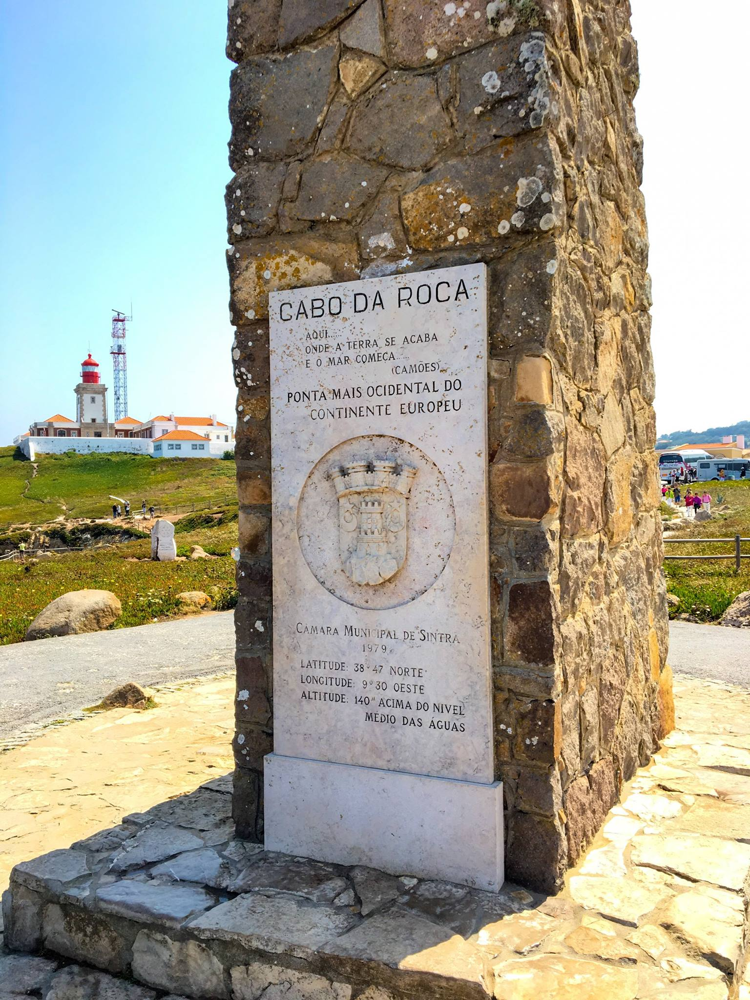

# Caption

Built-in GLightbox caption feature with title and description in the **light box** can be used by adding attributes: ```data-title```, ```data-description``` through markdown_extensions ```attr_list```. Enable ```attr_list``` via ```mkdocs.yml```:

```yaml
markdown_extensions:
  - attr_list
```

Check more details about ```attr_list``` on the [official document](https://python-markdown.github.io/extensions/attr_list/).

!!! warning "Warning"

    When the title or the description has been set, the plugin setting of lightbox image ```height``` and ```width``` will be overridden as ```100vh```.

## Usage

### Title and description attributes

```markdown title="Setting title and description with attributes"
{ data-title="Madeira, Portugal." data-description="Madeira, an autonomous region of Portugal, is an archipelago comprising 4 islands off the northwest coast of Africa. - Google" }
```

<div class="result" markdown>

{ width="500px" data-title="Madeira, Portugal." data-description="Madeira, an autonomous region of Portugal, is an archipelago comprising 4 islands off the northwest coast of Africa. - Google" }

</div>

### Caption position

Caption position can be changed with plugin option ```caption_position``` globally or individually by attribute ```data-caption-position```.

```markdown title="Setting position with data-caption-position"
{ data-title="Cabo da Roca, Portugal. Credit: Blueswen" data-description=".custom-desc1" data-caption-position="right"}
```

<div class="result" markdown>

{ width="400px" data-title="Cabo da Roca, Portugal. Credit: Blueswen" data-description="Monument announcing Cabo da Roca as the westernmost point of continental Europe" data-caption-position="right"}

</div>

### Advanced description

For a longer description, you can add a ```div``` with class ```glightbox-desc``` and a custom class name which be assigned in ```data-description``` with a prefix ```.```. The content in div will be used as the description.

```html title="Advanced Description"
{ width="500px" data-title="Cabo da Roca, Portugal. Credit: Blueswen" data-description=".custom-desc1" }

<div class="glightbox-desc custom-desc1">
  <p>Saint George's Castle is a historic castle in the Portuguese capital of Lisbon, located in the freguesia of Santa Maria Maior.</p>
  <p>Human occupation of the castle hill dates to at least the 8th century BC while the first fortifications built date from the 1st century BC.</p>
</div>
```

<div class="result" markdown>

{ width="500px" data-title="Cabo da Roca, Portugal. Credit: Blueswen" data-description=".custom-desc1" }

<div class="glightbox-desc custom-desc1">
<p>Saint George's Castle is a historic castle in the Portuguese capital of Lisbon, located in the freguesia of Santa Maria Maior.</p>
<p>Human occupation of the castle hill dates to at least the 8th century BC while the first fortifications built date from the 1st century BC.</p>
</div>
</div>

### Image alt as the caption

Since adding a title attribute to each image may be frustrating, we provide an ```auto_caption``` option to use the image alt as the default title.

- Globally: Enable the ```auto_caption``` plugin option in ```mkdocs.yml``` to affect whole mkdocs

    ```yaml
    plugins:
      - glightbox:
          auto_caption: true
    ```

- Locally: Add page metadata ```glightbox.auto_caption: true``` through markdown_extensions ```meta``` setting page meta on a specific page. Enable ```meta``` via ```mkdocs.yml```:

    ```yaml
    markdown_extensions:
      - meta
    ```

    Check more details about ```meta``` on the [official document](https://python-markdown.github.io/extensions/meta_data/).

```markdown title="Using image alt as caption title with page meta"
---
glightbox.auto_caption: true
---


```

<div class="result" markdown>

{ width="500px"}

</div>

### Caption on page

The built-in GLightbox caption feature only works in the **light box**. If you want the caption on the page beside the image too, you can consider using the `figure` and `figcaption` tags which mention in [Material for MkDocs document](https://squidfunk.github.io/mkdocs-material/reference/images/#image-captions). These features are also fully compatible with our plugin.

```markdown title="Using figure and figcaption"
---
glightbox.auto_caption: true
---

<figure markdown>
{ width="500px"}
<figcaption>Tulum, Mexico. Credit: Blueswen</figcaption>
</figure>
```

<div class="result" markdown>
<figure markdown>

{ width="500px"}

<figcaption>Tulum, Mexico. Credit: Blueswen</figcaption>
</figure>
</div>
