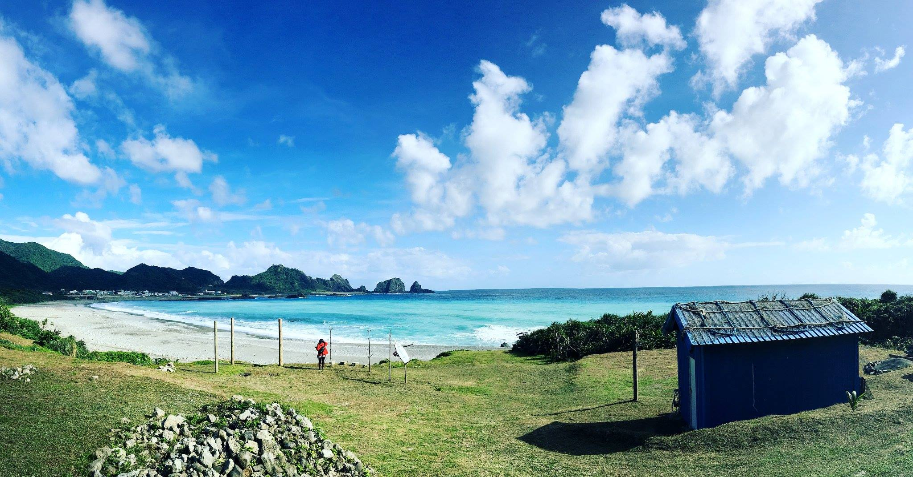
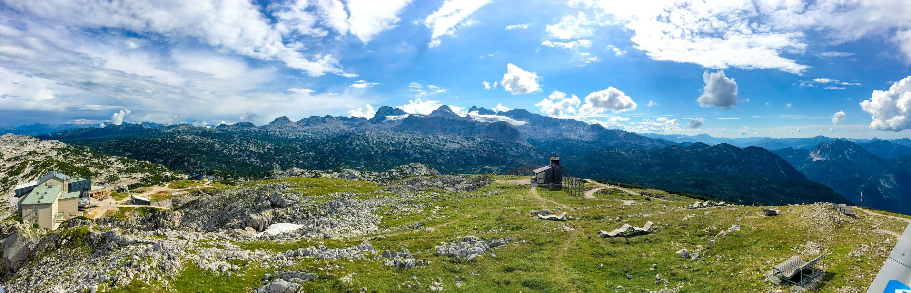

You can enable lightbox of images separately by adding page metadata ```glightbox-manual: true``` through markdown_extensions ```meta``` and adding ```on-glb``` class on the image through markdown_extensions ```attr_list```, and keep other images without lightbox effect. Enable ```meta``` and ```attr_list``` via ```mkdocs.yml```:

```yaml
markdown_extensions:
  - meta
  - attr_list
```

Check more details about ```meta``` on the [official document](https://python-markdown.github.io/extensions/meta_data/).

Check more details about ```attr_list``` on the [official document](https://python-markdown.github.io/extensions/attr_list/).

## Demo

Only images(first two images) with ```on-glb``` class will be added to the lightbox effect. Other images(third image) will be disabled.

```markdown
---
glightbox-manual: true
---

{ .on-glb } 
Lanyu, Taiwan. Credit: Blueswen

{ .on-glb } 
Hallstatt, Austria. Credit: Blueswen


Obertraun, Austria. Credit: Blueswen
```
<figure markdown>

{ .on-glb } 

<figcaption>Lanyu, Taiwan. Credit: Blueswen</figcaption>
</figure>

<figure markdown>

{ .on-glb } 

<figcaption>Hallstatt, Austria. Credit: Blueswen</figcaption>
</figure>

<figure markdown>

 

<figcaption>Obertraun, Austria. Credit: Blueswen</figcaption>
</figure>
